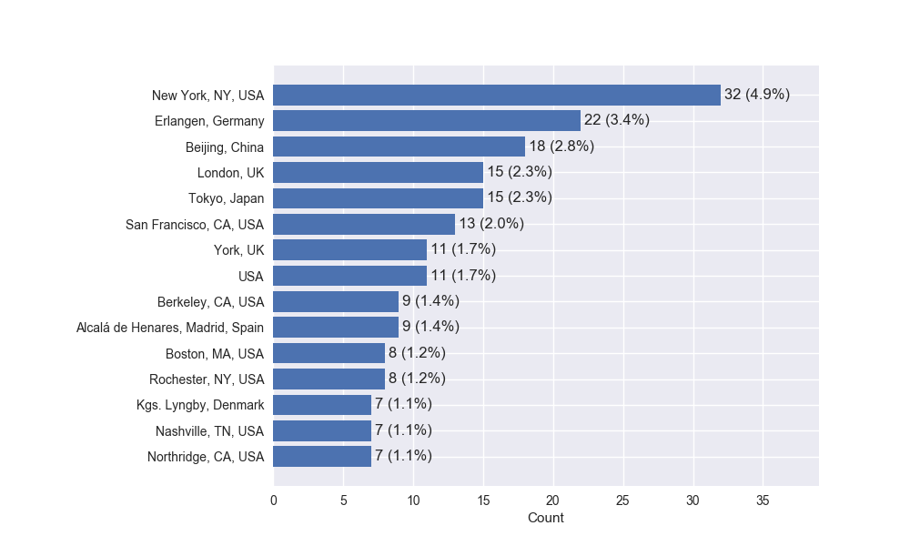

# 145th AES Convention Stats
Analysis and statistics of accpeted papers and presenters at the 145th AES Convention October 17-21, 2018 - New York, New York

The statistics for the accepted papers comes from the [convention table of contents page](http://www.aes.org/publications/conventions/?num=145). The presenters statistics are more general with respect to the convention program and cover talks and events outside of the technical/academic program. It is based upon the [presenter list](http://www.aes.org/events/145/presenters/) on the convention website.
## Papers
This section outlines statistics related to papers accepted to the convention. This includes papers that are presented in the form of talks as well as posters. 

Total number of accepted papers: 142 
Total number of affiliations: 140 
Total number of subjects: 11 
Total number of unqiue abstract words: 3270 

### Top Authors

 

### Top Affiliations
 

### Top Subjects

 

### Top Abstract Words

 

## Presenters
This section outlines statistics about all of the presenters at the convention. It it not limited to just accepted papers.

Total number of presenters: 651 
Total number of affiliations:  423 
Total number of cities: 260 
Total number of countries: 57 

### Top Affiliations

 

### Top Cities

### Top Countries

## Disclaimer
These statistics are only estimates. Formatting discrepancies in the scrapped data may skew some of these metrics.  

